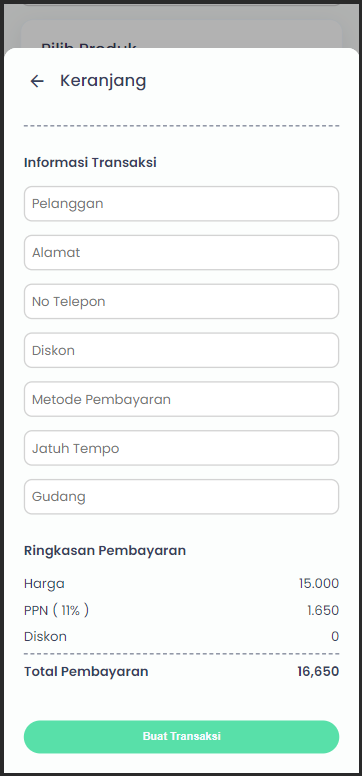

## How to Use Dandang Apps

### Current Version

-   current commit #19: 0.0.19 (mobile-support only)

## Jump to

-   [Cara Login](#login)

-   [Cara Membuat Transaksi Baru](#membuat-transaksi-baru)

-   [Cara Ganti Tone Applikasi](#ganti-tone-aplikasi)

-   [Cara Logout](#logout)

-   [Back to README](./README.md)

## Login

> [!NOTE]
> Jika tidak ada yg terjadi silakan buka console browser. Tekan F12 pada keyboard atau buka developer mode (mode pengembang)

-   Hubungi author untuk mendapat credential

-   Login menggunakan credential yang sudah diberikan pada https://gede-wahyu.github.io/dandang-apps/login

    

-   Setelah berhasil login, akan diarahkan ke laman utama (home) https://gede-wahyu.github.io/dandang-apps/

[⬆️ Back to Top ⬆️](#jump-to)

## Membuat Transaksi Baru

-   Dari lama utama (home), tekan ikon tambah / plus pada menu bottombar

    

-   Setelah laman siap akan nampak seperti gambar dibawah

    

-   Tekan tombol [ Tambah ] untuk memasukan produk ke keranjang

-   Tekan tombol dibawah gambar produk untuk mengubah atau menambah varian lain dari produk serupa

    

-   Gunakan tombol [ + ] untuk menambah jumlah produk ke keranjang dan [ - ] untuk mengurangi atau menghapus produk dari keranjang

    

-   Buka isi keranjang menggunakan tombol dibawah

    

-   Periksa kembali isi keranjang atau ubah isi keranjang dengan menekan tombol [ Edit ]

    

-   Isi data yang dibutuhkan dan periksa biaya transaksi

    

-   Tekan tombol [ Buat Transaksi ] untuk melanjutkan membuat transaksi

-   Selesai! transaksi telah dibuat

[⬆️ Back to Top ⬆️](#jump-to)

## Ganti Tone Aplikasi

-   Dari laman utama (Home), tekan icon cog / settings pada bottombar

-   Pilih tone dan tekan tombol [ Simpan ] untuk mengganti tone applikasi

-   Selesai! tone selesai diubah

[⬆️ Back to Top ⬆️](#jump-to)

## Logout

-   Dari laman utama (Home), tekan icon cog / settings pada bottombar

-   Tekan tombol logout

-   Selesai! akun ter-logout

[⬆️ Back to Top ⬆️](#jump-to)
